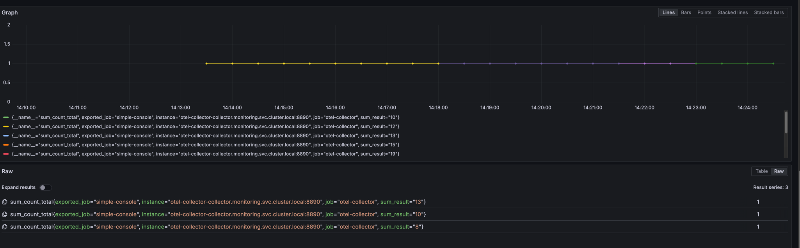

# Create venv
python -m venv .venv
source .venv/bin/activate

# Install minimum OTEL
```bash
pip install opentelemetry-sdk 
pip install opentelemetry-exporter-otlp
```

# Run with OTEL
```bash
python simple-console.py
```

# More for OTEL environment variables:
https://opentelemetry.io/docs/languages/sdk-configuration/otlp-exporter/
https://opentelemetry.io/docs/specs/otel/configuration/sdk-environment-variables/


# Demonstrating two variation of metrics.  In this case, they are similar:

### 1. Histogram
```bash
sum_histogram.record(result)
```
    A histogram records the value itself (result in this case).
    It’s used for measuring the distribution of a numeric variable over time (e.g., how big or small the sums are).
    
    Backends (Prometheus, Grafana, Elastic, etc.) can show: 
        min, max, avg of sums
        percentile distributions (p50, p90, p99)
        bucket counts
    
    Example question it answers:
    👉 “What is the average or 95th percentile of the sum results?”

### 2. Counter with Attribute
``` bash
sum_counter.add(1, {"sum_result": str(result)})
```
    
    A counter increments by a fixed value (1 here).
    
    You’re attaching an attribute "sum_result": str(result).
    This means you’re counting how often each particular sum value occurs.
    
    Example question it answers:
    👉 “How many times did we get a sum of 8 vs. 12 vs. 15?”


Metric Sample:


Trace Sample:
